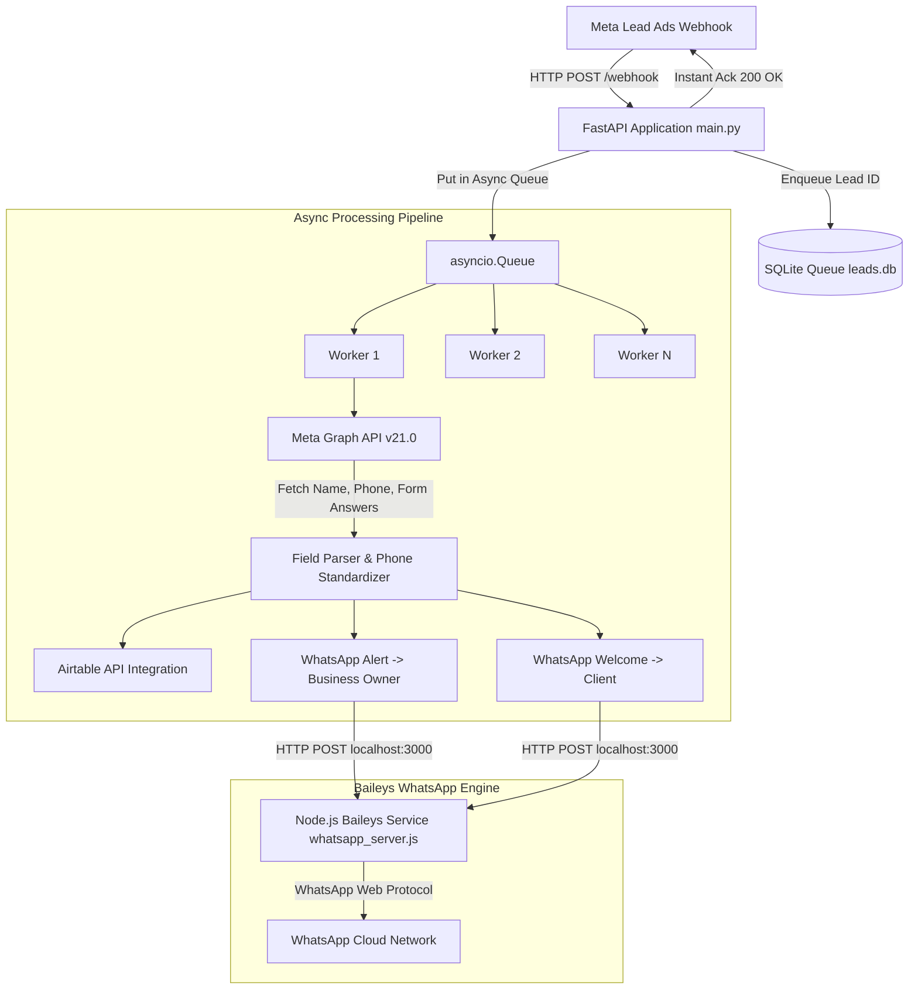

# Lead Automation System - Complete Architecture & Technical Documentation

## 1. System Overview & Architecture

This project is an enterprise-grade, zero-cost automated lead-processing pipeline. It connects **Meta Lead Ads (Facebook/Instagram)** to **Airtable** for storage and **WhatsApp** for instant notification alerts to both the Business Owner and the incoming Prospect.

### System Architecture Flow



---

## 2. Component Breakdown & Core Files

| File Path | Role & Key Functionality |
| :--- | :--- |
| [`main.py`](file:///d:/Downloads/lead-automation/main.py) | **FastAPI Core Service**: Receives Meta webhooks, verifies SHA-256 signatures, manages startup sequence, launches Node.js subprocess if port 3000 is inactive, handles `/qr` proxying, `/health` checks, and `/send-manual-lead`. |
| [`db.py`](file:///d:/Downloads/lead-automation/db.py) | **SQLite Queue Manager (`leads.db`)**: Handles thread-safe atomic inserts, deduplication check on `leadgen_id`, tracking retry counts, and retrieving unfinished leads upon server startup. |
| [`worker.py`](file:///d:/Downloads/lead-automation/worker.py) | **Background Queue Workers**: Runs `WORKER_COUNT` (default 5) parallel loops. Executes Meta Graph API fetch, Airtable insertion, owner alert, and client welcome message. Handles retries with exponential backoff. |
| [`integrations/meta_api.py`](file:///d:/Downloads/lead-automation/integrations/meta_api.py) | **Meta Graph API Client**: Fetches lead details for a given `leadgen_id`. Parses complex field structures, configuration/BHK answers, and normalizes Indian phone numbers into clean `+91` format. |
| [`integrations/airtable_api.py`](file:///d:/Downloads/lead-automation/integrations/airtable_api.py) | **Airtable API Client**: Creates records in Airtable (`Client Name`, `Phone Number`, `Configuration`, `Remark`, `Campaign Name`). Features dynamic schema adaptation for missing table columns and phone-based deduplication. |
| [`integrations/whatsapp_api.py`](file:///d:/Downloads/lead-automation/integrations/whatsapp_api.py) | **WhatsApp Integration Layer**: Constructs structured message bodies for Owner Alerts (`lead_alert`) and Client Welcome greetings (`lead_welcome`). Sends requests to local Baileys service with a strict 5s timeout. |
| [`whatsapp_server.js`](file:///d:/Downloads/lead-automation/whatsapp_server.js) | **Baileys Node.js Service**: Maintains an active WhatsApp Web connection via `@whiskeysockets/baileys`. Exposes `/qr` HTML page for browser QR scanning, `/status`, and `/send-message`. |
| [`config.py`](file:///d:/Downloads/lead-automation/config.py) | **Configuration Manager**: Centralized configuration reading from `.env` with fallback defaults. |
| [`add_lead.py`](file:///d:/Downloads/lead-automation/add_lead.py) | **CLI Manual Ingestion Tool**: Script to manually trigger lead processing either by Meta `LEAD_ID` or by explicit Name, Phone, BHK Config, and Campaign Name. |
| [`reprocess_past_leads.py`](file:///d:/Downloads/lead-automation/reprocess_past_leads.py) | **Batch Reprocessing Tool**: Iterates through all past lead IDs stored in `leads.db`, re-fetches details from Meta, updates Airtable, and dispatches WhatsApp messages. |

---

## 3. Key Engineering Enhancements & Resilience Features

### A. Meta Graph API Error Fallback (Zero Lead Loss)
- **Problem:** If Meta Graph API returns access token expiration, missing `pages_manage_ads` permission, or network failure, fetching lead fields fails.
- **Resilience Fix:** If Meta Graph API returns an error for a non-test lead, [`worker.py`](file:///d:/Downloads/lead-automation/worker.py) generates a structured fallback payload:
  - **Client Name:** `Lead <leadgen_id>`
  - **Campaign Name:** `Meta Lead Form (API Error)`
  - **Remark / Notes:** `Meta API error for Lead ID <leadgen_id>: <error_details>`
  - **Result:** **No lead is ever dropped or lost**, and a record is created in Airtable for manual follow-up.

### B. Indian Phone Number Format Standardization
- **Problem:** Meta form inputs vary widely (`9892749953`, `09892749953`, `919892749953`, `+919892749953`).
- **Resilience Fix:** [`parse_lead_fields`](file:///d:/Downloads/lead-automation/integrations/meta_api.py#L77-L92) normalizes all variations:
  - 10 digits (`9892749953` → `+919892749953`)
  - 11 digits starting with `0` (`09892749953` → `+919892749953`)
  - 12 digits starting with `91` (`919892749953` → `+919892749953`)
  - Valid international formats starting with `+` are preserved.

### C. Dynamic Airtable Schema Adaptation
- **Problem:** If the target Airtable base is missing an optional column (e.g. `Remark` or `Campaign Name`), Airtable rejects the request with `422 UNKNOWN_FIELD_NAME`.
- **Resilience Fix:** [`create_airtable_record`](file:///d:/Downloads/lead-automation/integrations/airtable_api.py#L50-L74) inspects `422` error messages, extracts the missing field name via regex, strips it from the payload, and retries up to 4 times.

### D. Non-Blocking 5.0-Second WhatsApp Timeout
- **Problem:** If WhatsApp is unlinked or QR code is awaiting scan, HTTP requests to `whatsapp_server.js` could block background workers.
- **Resilience Fix:** [`send_whatsapp_template`](file:///d:/Downloads/lead-automation/integrations/whatsapp_api.py#L43-L50) uses a strict **5.0-second timeout**. If WhatsApp is offline, the message is gracefully logged as `skipped` without hanging the worker or preventing Airtable storage.

### E. Deduplication Protection
- **Multi-Level Protection:**
  1. **SQLite Database Level:** Primary key constraint on `leadgen_id` in `leads.db`. Duplicate webhook notifications from Meta are instantly dropped.
  2. **Airtable Record Check:** [`lead_already_stored`](file:///d:/Downloads/lead-automation/integrations/airtable_api.py#L8-L26) checks Airtable by phone number before reprocessing or inserting.

### F. Auto-Process Manager & Startup Recovery
- **Startup Auto-Launch:** [`main.py`](file:///d:/Downloads/lead-automation/main.py#L27-L44) probes port 3000. If `whatsapp_server.js` is not active, it automatically launches it as a background process.
- **Unfinished Lead Re-queuing:** Any lead stuck in `pending` or `processing` due to an unexpected server crash is requeued upon startup.

---

## 4. API Endpoints Reference

| Endpoint | Method | Description |
| :--- | :--- | :--- |
| `/` | `GET`, `HEAD` | Redirects to `/qr` status page. |
| `/qr` | `GET` | Renders live WhatsApp Web QR Login UI. Auto-refreshes every 5 seconds until scanned. |
| `/webhook` | `GET` | Meta Webhook Verification challenge handler. |
| `/webhook` | `POST` | Meta Lead Webhook Ingress. Validates SHA-256 HMAC signature, enqueues lead, returns `200 OK`. |
| `/health` | `GET`, `POST`, `HEAD` | Health check endpoint for uptime monitoring (e.g., UptimeRobot). |
| `/send-manual-lead` | `GET`, `POST` | Manually triggers lead creation and notifications with deduplication check. |

---

## 5. Manual CLI Commands & Maintenance Utilities

### A. Process Lead by ID or Details (`add_lead.py`)

```bash
# Option 1: Ingest via Meta Lead ID
python add_lead.py 1044971085049692

# Option 2: Ingest via Name, Phone, BHK Config, Campaign
python add_lead.py "Ashish Shukla" "+919892749953" "2 BHK" "Silver 26 August"
```

### B. Reprocess All Past Leads (`reprocess_past_leads.py`)

```bash
# Reprocesses every lead in leads.db through Meta API, Airtable, and WhatsApp
python reprocess_past_leads.py
```

### C. Manual HTTP Ingestion Endpoint

```http
GET https://<your-render-app>.onrender.com/send-manual-lead?name=Ashish&phone=%2B919892749953&configuration=2_bhk&campaign=Silver%2026%20August
```

---

## 6. Configuration & Environment Variables (`.env`)

```ini
# --- Meta / Facebook Lead Ads Credentials ---
META_ACCESS_TOKEN=EAAdalBvu...
META_VERIFY_TOKEN=mysecretverifytoken123
META_APP_SECRET=2939d8232b1c6e6bb4e10e7f576bd88a
ALLOWED_FORM_ID=                        # Optional: Restrict processing to a single Meta Form ID

# --- WhatsApp & Notification Settings ---
OWNER_WHATSAPP_NUMBER=917738382905       # Business Owner WhatsApp number (with country code, no +)
ALERT_TEMPLATE_NAME=lead_alert
CLIENT_TEMPLATE_NAME=lead_welcome
TEMPLATE_LANGUAGE=en_US

# --- Airtable Integration ---
AIRTABLE_API_KEY=pateDYmhG...
AIRTABLE_BASE_ID=appnn2bLWJJFH4ceD
AIRTABLE_TABLE_NAME=tblginmsgXxiJ3K19   # Airtable Table Name or Table ID

# --- Application Runtime ---
WORKER_COUNT=5                          # Number of concurrent async background workers
PORT=8000                               # FastAPI server port
MAX_RETRIES=5                           # Maximum retry attempts per failed lead
```

---

## 7. Cloud Deployment & 24/7 Availability (Render + UptimeRobot)

1. **GitHub Synchronization:** Code resides on `main` branch of `https://github.com/aryanotavakar07-jpg/automate.git`.
2. **Render Auto-Deploy:** Render builds and starts the application using Python + Node environment.
3. **UptimeRobot Keep-Alive (24/7 Awake):**
   - **Target URL:** `https://<your-render-app>.onrender.com/health`
   - **Monitoring Interval:** Every 5 minutes.
   - **Purpose:** Prevents Render free tier from sleeping after 15 minutes of inactivity, guaranteeing sub-second response times for incoming Meta webhooks.

